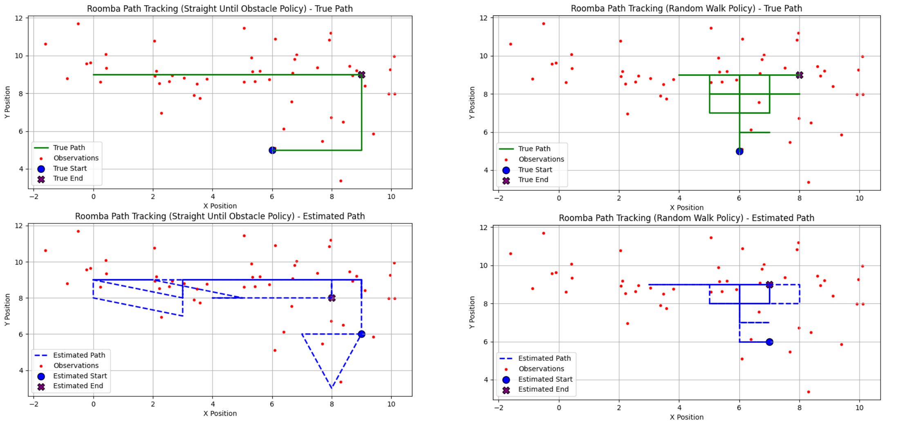

# Tracking a Roomba Using the Viterbi Algorithm

## 📚 **Project Overview**
In this project, we aim to track a Roomba robotic vacuum cleaner's most likely path using a **Hidden Markov Model (HMM)** and the **Viterbi Algorithm**. The environment simulates a 10×10 grid where the Roomba operates under two distinct movement policies, and noisy sensor observations are used to estimate its trajectory.

---

## 🚀 **Objective**
- Model the problem as a **Hidden Markov Model (HMM)**.
- Implement the **Viterbi Algorithm** to estimate the Roomba's path based on noisy observations.
- Evaluate and compare tracking accuracy for both movement policies.
- Analyze results across multiple seed values.
- Generate visualizations for comparison.
- Return a standardized `estimated_paths.csv` file.

---

## 🧠 **Environment and Policies**
### **Grid Environment:**
- A **10×10 grid** represents the home layout.
- Possible headings: **North (N)**, **East (E)**, **South (S)**, **West (W)**.
- Obstacles: The **4 walls** of the grid.

### **Movement Policies:**
1. **Random Walk Policy:**
   - Moves one unit per time step in any direction.
   - Randomly selects a new heading after each step.
2. **Straight Until Obstacle Policy:**
   - Moves deterministically in one direction until encountering an obstacle.
   - Chooses a new heading upon encountering an obstacle.

### **Sensor Observations:**
- Observations are noisy, modeled as **true position + Gaussian noise (mean=0, σ=1.0)**.
- Observations are pre-generated in the provided boilerplate code.

---

## 🛠️ **Tasks**
### **Task 1: Model the Problem as an HMM**
- **State Space:** Define grid positions and directions as states.
- **Transition Probabilities:** Define probabilities for each movement policy.
- **Emission Probabilities:** Model sensor noise with Gaussian distribution.

### **Task 2: Implement the Viterbi Algorithm**
- Implement the **Viterbi Algorithm** to estimate the Roomba's most likely path.
- Use the noisy sensor observations as input.

### **Task 3: Evaluation Across Seed Values**
For **at least 3 different seed values:**
- Setup the environment and extract **true path** and **noisy observations**.
- Estimate the Roomba's path using the **Viterbi Algorithm**.
- Compare estimated paths with true paths using `evaluate_viterbi()`.
- Analyze the tracking accuracy for both movement policies.
- Plot:
   - True Path
   - Observed Positions
   - Estimated Path

### **Task 4: Seed Value Documentation**
- Clearly state the **chosen seed values**.
- Ensure your code handles edge cases and exceptions gracefully.
- Ensure compatibility for evaluation on any seed value.

### **Task 5: CSV Output**
Generate a standardized `estimated_paths.csv` file with:
| **Seed Value** | **Policy Name** | **Estimated Path** |
|---------------|-----------------|-------------------|

- Maintain the specified formatting for evaluation.

---

## 📊 **Evaluation Metrics**
- **Tracking Accuracy:** Evaluate path correctness using the provided function.
- **Runtime:** Record time taken to estimate paths.
- **Policy Comparison:** Identify which movement policy performs better.

- Currently, **`seed value - 2024`** is used as:

 It provides a balance between randomness and predictability in simulations. Seeds are used to initialize random
 number generators, ensuring reproducibility of results while allowing for natural variations in random behaviours.
    
• `Consistency:` Using a specific seed ensures that the random scenarios generated (like Roomba's movements and noisy observations) can be reproduced for debugging or testing.

• `Unbiased Results:` A mid-range seed like 2024 avoids biases that sometimes occur with smaller values or commonly used seeds.

---

## 📈 **Results Visualization**
- **True Path vs Estimated Path:** Visualize deviations.
- **Noisy Observations:** Plot sensor noise effect.
- **Policy Comparison Graphs:** Present key findings.

*Path Visualization for seed value 2024*

---


## ⚙️ **Setup and Usage**

## **Virtual Environment Setup (Recommended)**

To ensure a clean and isolated development environment, it is highly recommended to use a **virtual environment** (`venv`) for this project.  

### 🛠️ **Steps to Set Up `venv`:**

1. Clone the repository:
   ```bash
   git clone <repository_url>
   ```
2. **Create a Virtual Environment:**  
   ```bash
   python -m venv venv
3. **Activate the Virtual Environment:**
   - **On Windows:**
    ```cmd
    .\venv\Scripts\activate
    ```
   - **On macOS/Linux:**
    ```bash
    source venv/bin/activate
    ```
4. **Install Dependencies:**
   ```bash
   pip install -r requirements.txt
   ```
5. **Deactivate the Environment (When Done):**
    ```bash
    deactivate
    ```
6. Run the main script:
   ```bash
   python main.py
   ```
7. Ensure the `estimated_paths.csv` file is generated correctly.

---

## 📝 **Conclusion**
- Successfully implemented the **Viterbi Algorithm** for path estimation.
- Compared tracking accuracy across multiple seed values.
- Identified the more effective movement policy.
- Generated standardized results for reproducibility.

---

## 🤝 **Contributing**
Contributions are welcome! Please open an issue for significant changes.

---

## 📬 **Contact**
For further inquiries or collaboration opportunities, feel free to reach out!

---

Happy Coding! 🤖🚀

*Note: Ensure `estimated_paths.csv` and visualizations are included/generated.*

